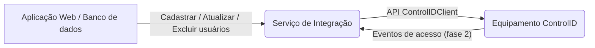
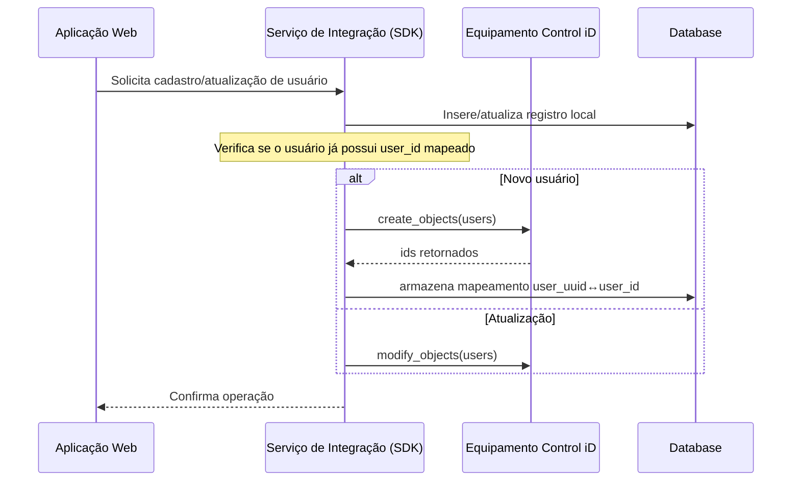
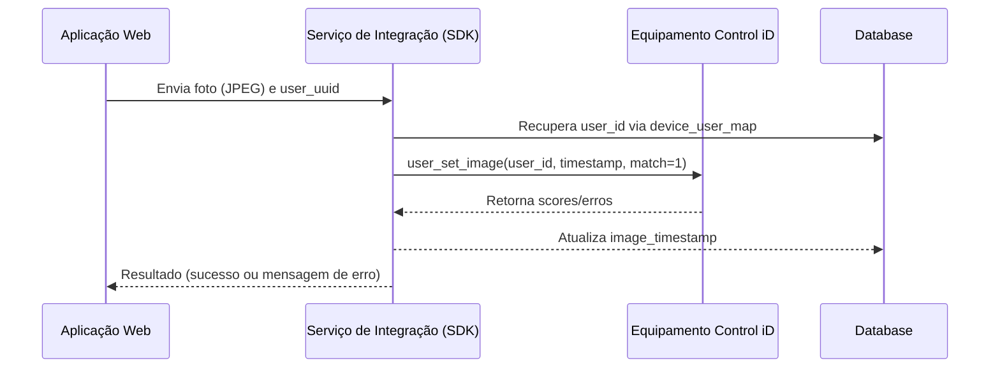

# Documento de Arquitetura de Integração

Este documento apresenta a arquitetura proposta para integrar o sistema web com os equipamentos de acesso da Control iD. O objetivo é manter uma base de usuários sincronizada, incluir fotos para reconhecimento facial e preparar a captura de eventos futuros.

## Visão geral

O sistema será composto por três camadas principais:

1. **Backend do cliente (nosso servidor)**: sistema responsável por cadastrar e gerenciar usuários, grupos e regras de acesso na aplicação principal. Também será responsável por orquestrar a sincronização com os equipamentos Control iD.
2. **SDK/Cliente Control iD (biblioteca Python)**: encapsula as chamadas à API REST dos equipamentos, gerenciando sessão, timeouts, retries e tratamento de erros. Este cliente é usado tanto pelo backend quanto pelos scripts de sincronização e testes.
3. **Equipamento Control iD**: dispositivo físico que armazena usuários, regras e fotos faciais. Opera em modo stand‑alone (decisão de acesso local) ou online (decisão via servidor).

### Diagrama de contexto

O serviço de integração (B) utiliza o `ControlIDClient` para enviar/receber dados do equipamento. A integração é assíncrona e idempotente.

## Modelo de dados local

Para mapear entidades do nosso banco aos IDs do equipamento, propõe‑se uma estrutura de tabelas auxiliares:

- **device**: representa cada equipamento (id, serial, endereço IP, último sincronismo).
- **device_user_map**: mapeia `user_uuid` (UUID no nosso sistema) para `device_id` e `user_id` (int64 gerado pelo equipamento), além de `image_timestamp` para controle de fotos.
- **sync_status**: registra o estado de sincronização (última execução, quantidade de registros sincronizados, erros).

## Fluxo "Cadastrar usuário"

## Fluxo "Cadastrar facial (iDFace)"

## Estratégia de sincronização e idempotência

1. **Chave natural**: utiliza‑se o campo `registration` como identificador natural do usuário no equipamento. Antes de criar um novo usuário, o serviço consulta via `load_objects` se há registro existente com o mesmo `registration`.  
2. **Registro local**: todas as operações são acompanhadas de registros em `device_user_map`, permitindo reconciliação futura.  
3. **Marcação temporal**: ao cadastrar uma foto, o timestamp do dispositivo (`image_timestamp`) é armazenado para evitar reenvios desnecessários.  
4. **Retries e backoff**: falhas temporárias no equipamento (ex.: rede) são tratadas com novas tentativas após pequenos atrasos. A sessão é verificada via `session_is_valid` antes de cada lote.

## Observabilidade

Cada requisição para o equipamento incluirá um `request_id` (UUID) gerado pelo serviço. O `ControlIDClient` expõe hooks para registrar logs antes e depois da chamada. Recomenda‑se enviar métricas de latência, taxa de sucesso/erro e contadores para uma solução de monitoramento (ex.: Prometheus, Grafana). As mensagens de erro retornadas pela API são propagadas para facilitar o diagnóstico.